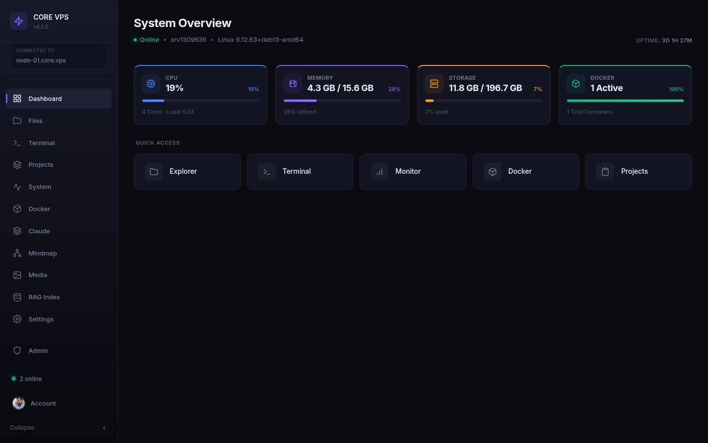
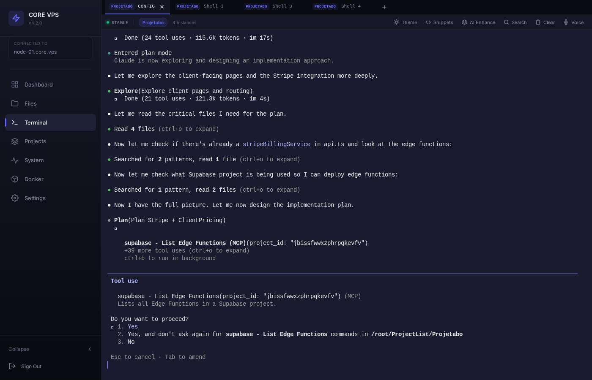
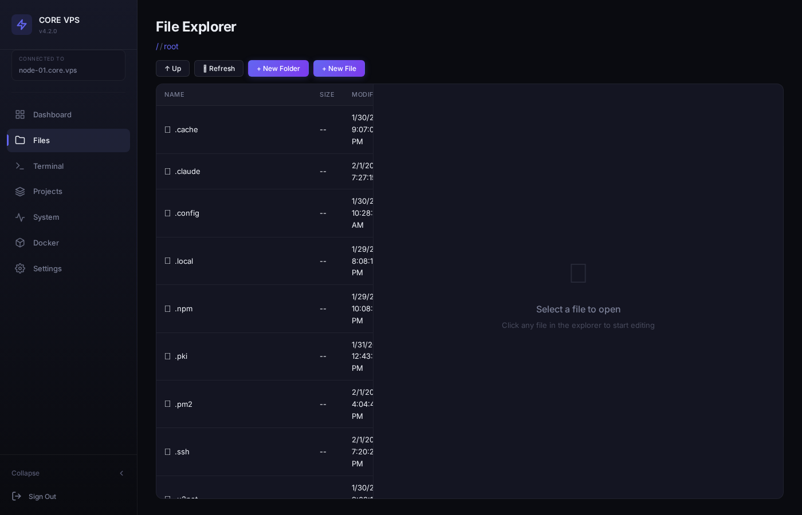
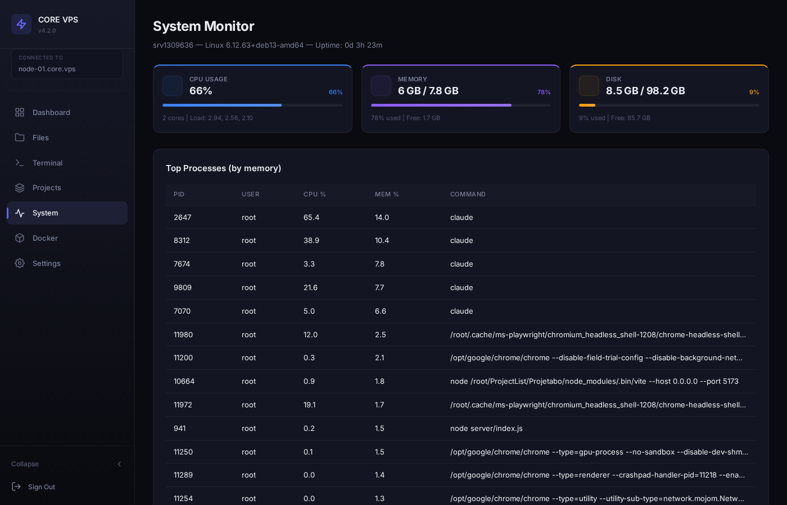
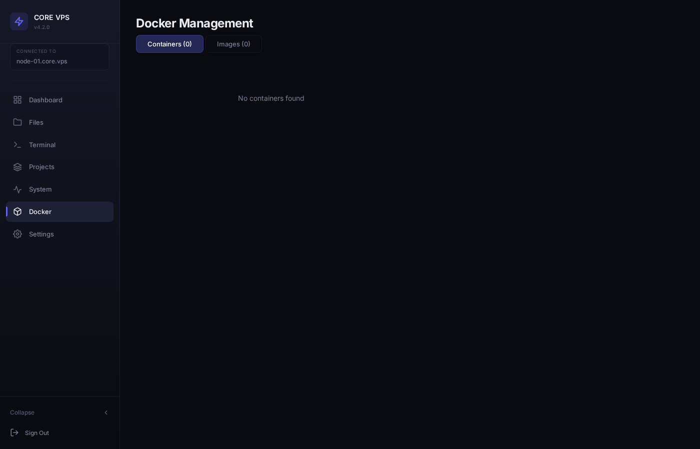
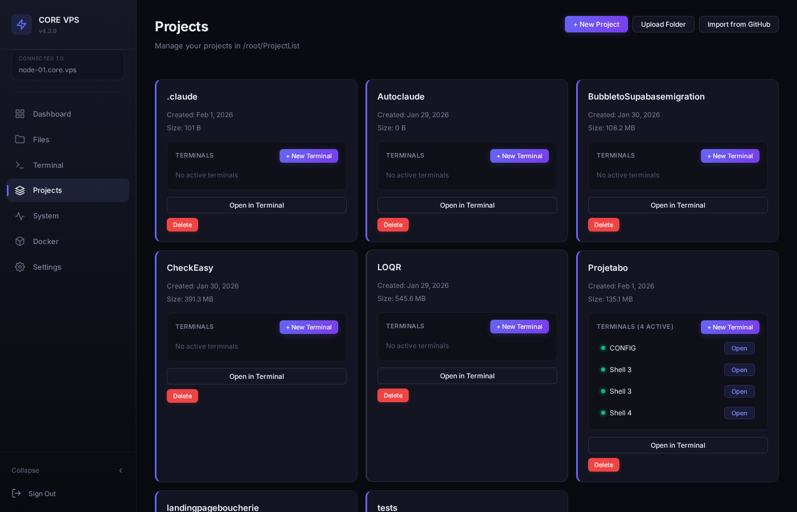
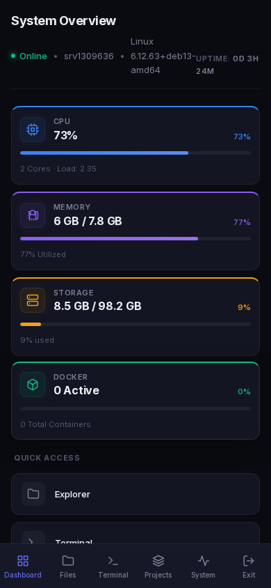
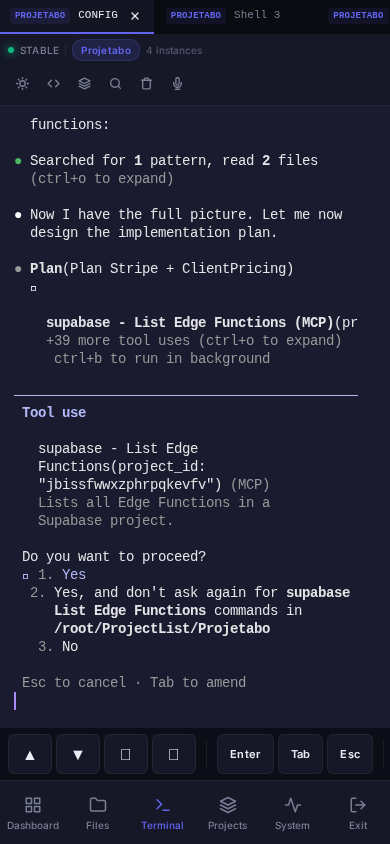

<div align="center">

# Nexterm

### Next-Gen Self-Hosted VPS Management Dashboard

A powerful, self-hosted web interface for managing your Linux server. Terminal, file explorer, Docker control, system monitoring, project management, AI-powered mindmap, and Claude Code integration -- all from your browser.

[](https://nodejs.org/)
[](https://react.dev/)
[](LICENSE)
[](CONTRIBUTING.md)

<br />



</div>

---

## Features

### Web Terminal
Full-featured terminal with multi-tab support (up to 10 sessions), PTY via `node-pty` and `xterm.js`. WebGL-accelerated rendering, search, clipboard, unicode, and web links. 6 built-in color themes (Default, Dracula, Monokai, Solarized Dark, Nord, One Dark). Voice input via Web Speech API. Saveable command snippets. Per-project terminal sessions with persistent history.



### AI Command Enhancement
Built-in AI assistant that improves your shell commands. Powered by OpenAI API with multi-turn conversation support. Type a command, hit "AI Enhance", and get an optimized version. Context is preserved across interactions for smarter suggestions.

### File Explorer & Code Editor
Browse your entire filesystem. Edit files with CodeMirror 6 featuring syntax highlighting for JavaScript, TypeScript, JSON, CSS, HTML, Python, YAML, Markdown, and Shell. Tabbed editing, create/delete files and folders. Upload entire folders with preserved directory structure.



### System Monitoring
Real-time CPU, memory, and disk usage with auto-refresh (5s interval). Top processes table sorted by resource consumption. Server hostname, kernel version, load average, and uptime at a glance.



### Docker Management
List, start, stop, restart, pause, unpause, and remove containers. View container logs. Browse Docker images. All from a clean card-based interface with real-time refresh.



### Project Management
Create new projects, import from GitHub (with real-time git clone progress via SSE), upload folders, manage terminal sessions per project, and delete projects. Full project lifecycle from one page.



### AI Mindmap
Interactive force-directed graph visualizing your entire development ecosystem. Projects, plugins, skills, and AI agents displayed as interconnected nodes with D3.js. Drag, zoom, link nodes, and manage relationships visually. Right-click context menus for quick actions. Persistent node positions saved to SQLite.

- **Agent Management**: Create, edit, activate/deactivate Claude Code agents directly from the mindmap. Full inline editing of agent name, description, model, and system prompt
- **Auto-Discovery**: Agents created via Claude CLI (`~/.claude/agents/*.md`) are automatically detected and displayed
- **AI-Assisted Prompt Generation**: Generate agent descriptions and system prompts with one click using OpenAI
- **Project-Agent Linking**: Assign agents to projects visually with drag-and-link or context menu
- **Central Hub**: Core "nexterm" node at the center with all projects orbiting around it

### Claude Code Integration
Dedicated configuration page for managing Claude Code settings. View and manage agents, skills, and plugins from a unified interface. Full compatibility with Claude CLI -- agents created from the dashboard work seamlessly with `/agents` in the terminal.

### SSH Key Management
Generate and manage Ed25519 SSH keys directly from the settings page. Test your SSH connection to GitHub with one click. Copy public key to clipboard for easy setup.

### Mobile-First PWA
Installable as a Progressive Web App. Bottom navigation bar, touch-friendly controls (44px minimum tap targets), responsive layouts. The terminal includes a mobile control bar with arrow keys, Enter, Tab, Esc, and Ctrl shortcuts.

<div align="center">

&nbsp;&nbsp;&nbsp;&nbsp;

</div>

---

## Tech Stack

| Layer | Technologies |
|-------|-------------|
| **Backend** | Node.js, Express, Socket.IO, node-pty, better-sqlite3 |
| **Frontend** | React 18, Vite 5, React Router 6, D3.js, xterm.js 5, CodeMirror 6 |
| **AI** | OpenAI API (gpt-5-mini), Claude Code CLI integration |
| **Auth** | JWT (24h expiry) + bcrypt password hashing |
| **Database** | SQLite (terminal sessions) |
| **SSL** | Self-signed certificate (auto-generated) |
| **PWA** | Service worker, manifest, offline shell caching |
| **Style** | Custom CSS, dark theme, mobile-first responsive |

---

## Quick Start

### Prerequisites

- **Node.js** >= 18
- **npm** >= 9
- **Linux** server (Debian/Ubuntu recommended)
- `make` and `g++` (for `node-pty` compilation)

### Installation

```bash
# Clone the repository
git clone https://github.com/Antoinecarle/Nexterm.git
cd Nexterm

# Install all dependencies (backend + frontend)
npm run install-all

# Create your environment file
cp .env.example .env
# Edit .env with your own password hash and JWT secret

# Generate SSL certificate
mkdir -p ssl
openssl req -x509 -nodes -days 365 -newkey rsa:2048 \
  -keyout ssl/key.pem -out ssl/cert.pem \
  -subj "/CN=localhost"

# Build the frontend
npm run build

# Start the server
npm start
```

The dashboard will be available at `https://your-server-ip` (port 443).

### Default Credentials

| Field | Value |
|-------|-------|
| Email | `admin@vps.local` |
| Password | `admin123` |

> **Important:** Change the default password immediately after first login by updating the `PASSWORD_HASH` in your `.env` file.

### Environment Variables

Create a `.env` file at the project root:

```env
EMAIL=admin@vps.local
PASSWORD_HASH=$2a$10$YOUR_BCRYPT_HASH_HERE
JWT_SECRET=your-secret-key-here
PORT=3000
SSL_PORT=443
```

Generate a bcrypt hash for your password:

```bash
node -e "const bcrypt = require('bcryptjs'); bcrypt.hash('your-password', 10).then(h => console.log(h))"
```

---

## Architecture

```
┌─────────────────────────────────────────────────┐
│                   Browser                        │
│         (React SPA / PWA / Mobile)               │
└────────────────┬────────────────────────────────┘
                 │ HTTPS (443)
┌────────────────▼────────────────────────────────┐
│              Express Server                      │
│                                                  │
│  ┌──────────┐  ┌──────────┐  ┌───────────────┐ │
│  │ REST API │  │ Static   │  │  Socket.IO    │ │
│  │ (JWT)    │  │ Files    │  │  (Terminal)   │ │
│  └────┬─────┘  └──────────┘  └───────┬───────┘ │
│       │                              │          │
│  ┌────▼─────────────────────────────▼────────┐  │
│  │              Node.js Runtime               │  │
│  │                                            │  │
│  │  ┌─────────┐ ┌────────┐ ┌──────────────┐ │  │
│  │  │node-pty │ │SQLite  │ │ Docker API   │ │  │
│  │  │(PTY)    │ │(DB)    │ │ (REST)       │ │  │
│  │  └─────────┘ └────────┘ └──────────────┘ │  │
│  └────────────────────────────────────────────┘  │
└──────────────────────────────────────────────────┘
```

---

## API Reference

All routes (except `/api/auth/login`) require a valid JWT token in the `Authorization: Bearer <token>` header.

### Authentication

| Method | Route | Description |
|--------|-------|-------------|
| `POST` | `/api/auth/login` | Login with email + password, returns JWT |

### System

| Method | Route | Description |
|--------|-------|-------------|
| `GET` | `/api/system/info` | CPU, RAM, disk, uptime, OS info |
| `GET` | `/api/system/processes` | Top processes by resource usage |

### Files

| Method | Route | Description |
|--------|-------|-------------|
| `GET` | `/api/files/list?path=` | List directory contents |
| `GET` | `/api/files/read?path=` | Read file content (max 2MB) |
| `POST` | `/api/files/write` | Write file `{path, content}` |
| `POST` | `/api/files/mkdir` | Create directory `{path}` |
| `DELETE` | `/api/files?path=` | Delete file or directory |

### Docker

| Method | Route | Description |
|--------|-------|-------------|
| `GET` | `/api/docker/containers` | List all containers |
| `GET` | `/api/docker/images` | List all images |
| `POST` | `/api/docker/containers/:id/:action` | Container action (start/stop/restart/pause/unpause/remove) |
| `GET` | `/api/docker/containers/:id/logs` | Get container logs |

### Terminal Sessions

| Method | Route | Description |
|--------|-------|-------------|
| `GET` | `/api/terminal/sessions` | List all sessions |
| `POST` | `/api/terminal/sessions` | Create session `{name, project, cols, rows}` |
| `PATCH` | `/api/terminal/sessions/:id` | Rename session `{name}` |
| `DELETE` | `/api/terminal/sessions/:id` | Delete session |

### Projects

| Method | Route | Description |
|--------|-------|-------------|
| `GET` | `/api/projects` | List projects with metadata |
| `POST` | `/api/projects` | Create empty project `{name}` |
| `POST` | `/api/projects/import` | Git clone via SSE `{url, name?}` |
| `POST` | `/api/projects/upload` | Upload folder (multipart) |
| `DELETE` | `/api/projects/:name` | Delete project |

### Settings

| Method | Route | Description |
|--------|-------|-------------|
| `GET` | `/api/settings/ssh-key` | Get public SSH key |
| `POST` | `/api/settings/ssh-key/regenerate` | Generate new Ed25519 key pair |
| `POST` | `/api/settings/ssh-test` | Test SSH connection to GitHub |

### Mindmap

| Method | Route | Description |
|--------|-------|-------------|
| `GET` | `/api/mindmap/data` | Get full mindmap graph (nodes, links, positions) |
| `POST` | `/api/mindmap/positions` | Save node positions `{positions: [{node_id, x, y}]}` |
| `POST` | `/api/mindmap/link` | Link two nodes `{source, target}` |
| `DELETE` | `/api/mindmap/link` | Unlink two nodes `{source, target}` |
| `GET` | `/api/mindmap/agents/all` | List all agents with active status |
| `POST` | `/api/mindmap/agents/activate` | Activate an agent `{name}` |
| `POST` | `/api/mindmap/agents/deactivate` | Deactivate an agent `{name}` |
| `POST` | `/api/mindmap/create-agent` | Create a new Claude agent `{name, description, prompt, model}` |
| `PUT` | `/api/mindmap/agent/:name` | Update agent fields `{description, model, prompt}` |
| `DELETE` | `/api/mindmap/agent/:name` | Delete an agent |
| `POST` | `/api/mindmap/assist-agent` | AI-generate agent description & prompt `{name, description}` |

### Claude

| Method | Route | Description |
|--------|-------|-------------|
| `GET` | `/api/claude/config` | Get Claude Code configuration |

### WebSocket

| Namespace | Events | Description |
|-----------|--------|-------------|
| `/terminal` | `create-session`, `attach-session`, `input`, `output`, `resize`, `kill-session`, `ai-enhance`, `ai-reset` | Real-time PTY terminal + AI |

---

## Project Structure

```
nexterm/
├── server/
│   ├── index.js              # Entry point: Express + HTTPS + Socket.IO
│   ├── auth.js               # JWT authentication + middleware
│   ├── db.js                 # SQLite database (terminal sessions)
│   ├── terminal.js           # WebSocket PTY terminal handler
│   └── routes/
│       ├── system.js         # System monitoring endpoints
│       ├── files.js          # File explorer endpoints
│       ├── docker.js         # Docker management endpoints
│       ├── terminal.js       # Terminal session CRUD
│       ├── projects.js       # Project management + git import
│       ├── settings.js       # SSH key management
│       ├── claude.js         # Claude Code config endpoints
│       └── mindmap.js        # Mindmap CRUD, agents, AI assist
│
├── client/
│   ├── src/
│   │   ├── App.jsx           # Routes & layout
│   │   ├── api.js            # JWT-authenticated fetch wrapper
│   │   ├── pages/
│   │   │   ├── Login.jsx     # Authentication page
│   │   │   ├── Dashboard.jsx # System overview + quick access
│   │   │   ├── Terminal.jsx  # Multi-tab PTY terminal
│   │   │   ├── Files.jsx     # File explorer + code editor
│   │   │   ├── System.jsx    # System monitor + processes
│   │   │   ├── Docker.jsx    # Container & image management
│   │   │   ├── Projects.jsx  # Project lifecycle management
│   │   │   ├── Settings.jsx  # SSH key management
│   │   │   ├── Claude.jsx    # Claude Code configuration
│   │   │   └── Mindmap.jsx   # D3.js force-directed mindmap
│   │   ├── components/
│   │   │   ├── Layout.jsx    # Sidebar (desktop) / bottom nav (mobile)
│   │   │   ├── StatCard.jsx  # Metric card with progress bar
│   │   │   ├── CodeEditor.jsx# CodeMirror 6 wrapper
│   │   │   └── ...
│   │   └── styles/
│   │       └── global.css    # Dark theme + responsive styles
│   └── public/
│       ├── manifest.json     # PWA manifest
│       └── sw.js             # Service worker
│
├── .env.example              # Environment template
├── package.json              # Backend dependencies
└── README.md
```

---

## Development

```bash
# Start the backend server
npm start

# In another terminal, start the frontend dev server with hot-reload
cd client && npm run dev
```

The Vite dev server proxies API requests to the Express backend automatically.

---

## Security

- Passwords are hashed with **bcrypt** (never stored in plain text)
- All API routes are protected by **JWT middleware**
- WebSocket connections require a valid JWT token
- File reads are capped at **2MB** to prevent abuse
- Project names are validated with strict regex `[a-zA-Z0-9_-]+`
- SSL/TLS encryption on all connections
- Sensitive files (`.env`, `ssl/`, `data/`) excluded from version control

---

## Roadmap

- [x] Plugin system (MCP plugins, skills, agents)
- [x] AI-powered mindmap visualization
- [x] Claude Code integration
- [ ] Multi-user support with role-based access control
- [ ] Two-factor authentication (2FA)
- [ ] Docker Compose support
- [ ] Built-in Nginx reverse proxy management
- [ ] Automated backups
- [ ] Notification system (email, webhook)
- [ ] Dark/light theme toggle

---

## Contributing

Contributions are welcome! Please feel free to submit a Pull Request.

1. Fork the repository
2. Create your feature branch (`git checkout -b feature/amazing-feature`)
3. Commit your changes (`git commit -m 'Add amazing feature'`)
4. Push to the branch (`git push origin feature/amazing-feature`)
5. Open a Pull Request

---

## License

This project is licensed under the MIT License - see the [LICENSE](LICENSE) file for details.

---

<div align="center">

**Built with Node.js, React, and a lot of terminal sessions.**

[Report Bug](https://github.com/Antoinecarle/Nexterm/issues) | [Request Feature](https://github.com/Antoinecarle/Nexterm/issues)

</div>
