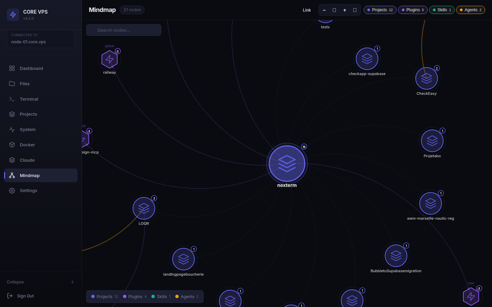
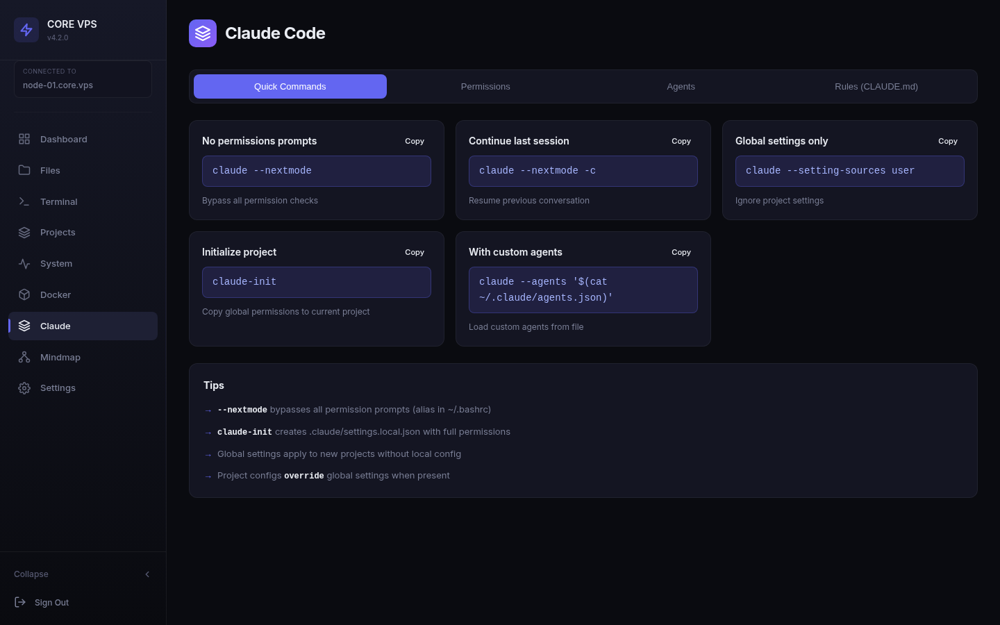
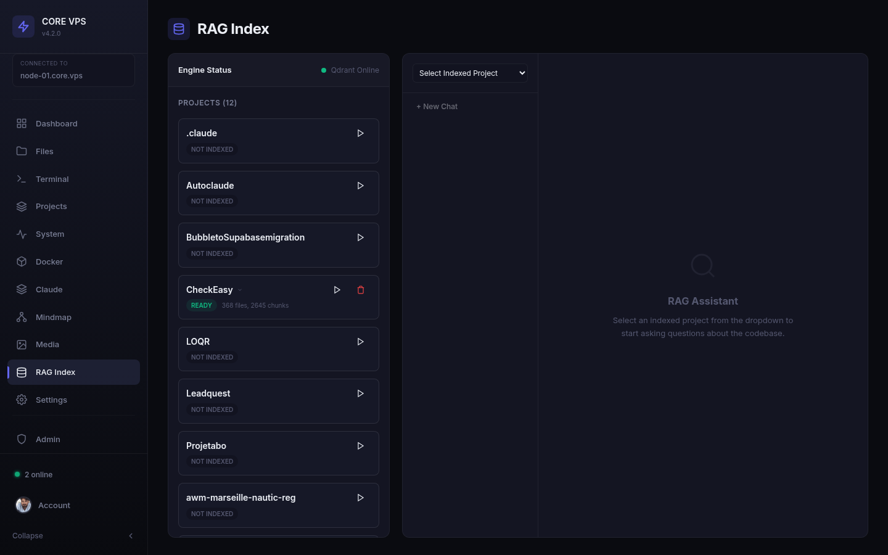
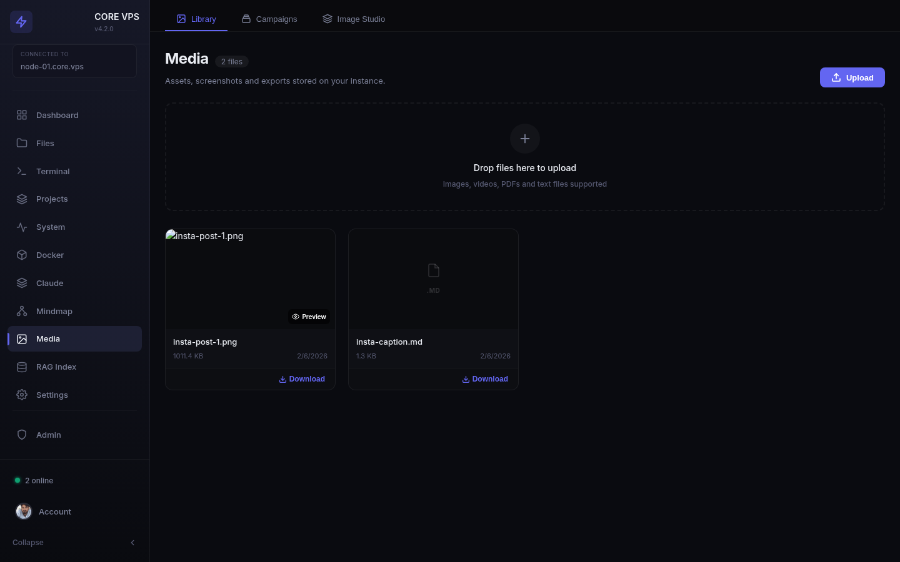
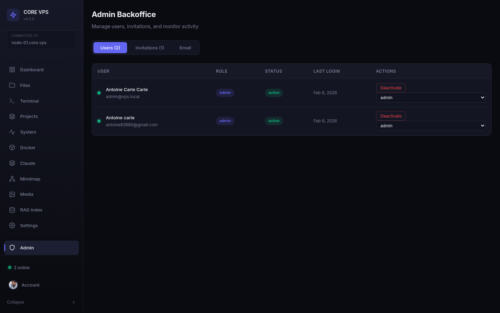
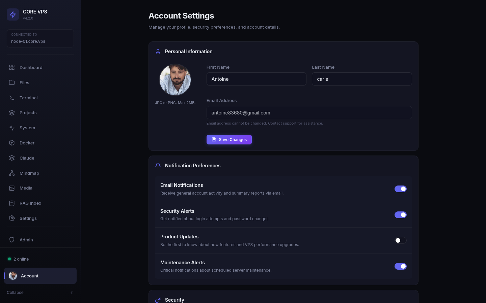
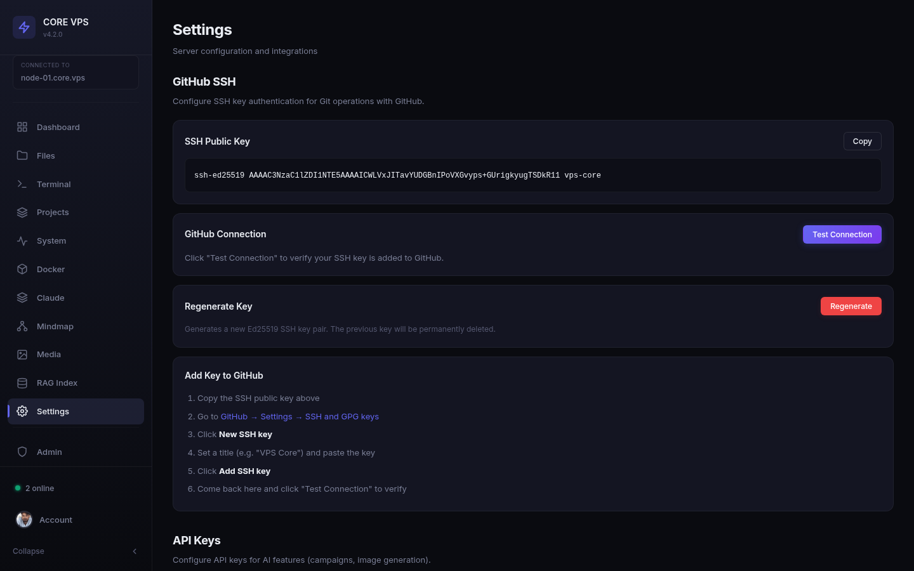

<div align="center">

# Nexterm

### AI-Powered Self-Hosted VPS Management

Manage your Linux server with AI at the core. Claude Code agents, interactive mindmap, AI-enhanced terminal, RAG-powered codebase search, media management with AI campaigns, multi-user system, file explorer, Docker, monitoring -- a complete development cockpit from your browser.

[](https://nodejs.org/)
[](https://react.dev/)
[](https://docs.anthropic.com/en/docs/claude-code)
[](LICENSE)
[](CONTRIBUTING.md)

</div>

---

## AI-First Development

Nexterm is built around the idea that your server management dashboard should understand your projects, your agents, and your AI workflow. It's not just a terminal -- it's a development cockpit where Claude Code, custom agents, and your infrastructure come together.

---

## Features

### AI Mindmap -- Your Project Brain

Interactive force-directed graph that visualizes your entire development ecosystem. Projects, plugins, skills, and AI agents as interconnected nodes. This is where you design, link, and orchestrate everything.

- **Create & edit Claude Code agents** directly from the UI -- name, description, model, system prompt
- **Auto-discovery** -- agents created via CLI (`~/.claude/agents/*.md`) appear automatically
- **AI-assisted prompt generation** -- one click to generate agent descriptions and system prompts with OpenAI
- **Link agents to projects** visually with drag-and-link or context menu
- **Activate / deactivate agents** with toggle switches -- control what's visible without deleting
- **Central hub** -- core nexterm node at the center, projects orbit around it



### Claude Code Integration

Full bridge between Nexterm and Claude Code CLI. Agents you create from the dashboard work instantly with `/agents` in the terminal. Manage permissions, view CLAUDE.md rules, and configure everything from a dedicated page.

- Agents stored as `~/.claude/agents/*.md` (native Claude CLI format)
- Quick commands: `claude --nextmode`, `claude-init`, custom agent invocations
- View and manage permissions, global settings, project rules



### AI-Enhanced Terminal

Full-featured PTY terminal with built-in AI. Multi-tab (up to 10 sessions), WebGL rendering, 6 color themes. The AI layer improves your shell commands in real-time -- type a command, hit "AI Enhance", get an optimized version. Multi-turn context is preserved across interactions.

- Per-project terminal sessions with persistent history
- Voice input via Web Speech API
- Saveable command snippets
- Search, clipboard, unicode, web links


### File Explorer & Code Editor

Browse your entire filesystem. Edit with CodeMirror 6 -- syntax highlighting for JS, TS, JSON, CSS, HTML, Python, YAML, Markdown, Shell. Tabbed editing, folder upload with preserved structure.


### Project Management

Create, import from GitHub (real-time git clone via SSE), upload folders, link terminal sessions and AI agents per project. Full lifecycle management.


### Docker Management

List, start, stop, restart, pause, remove containers. View logs. Browse images. Clean card-based interface with real-time refresh.


### System Monitoring

Real-time CPU, memory, disk with 5s auto-refresh. Top processes, hostname, kernel, load average, uptime.


### RAG Index -- AI-Powered Codebase Search

Index your projects into a Qdrant vector database and chat with your codebase. Ask questions about any indexed project and get context-aware answers powered by embeddings and GPT.

- **One-click indexing** -- select a project, hit play, and the RAG engine chunks, embeds, and stores your code
- **Qdrant integration** -- real-time engine status, collection stats (files, chunks)
- **Chat interface** -- select an indexed project from the dropdown and ask questions about the code
- **Multi-project support** -- index and query across all your projects independently
- **Re-index** -- update the index when your codebase changes



### Media Library & AI Campaigns

Upload, manage, and organize media assets (images, videos, PDFs, text files). Built-in AI-powered campaign tools for social media content generation with Gemini.

- **Drag & drop upload** -- drop files directly into the library
- **Image Studio** -- AI image generation with Google Gemini
- **Campaigns** -- create social media campaigns with AI-generated captions and hashtags
- **Preview & download** -- inline preview for images, download any asset
- **File metadata** -- size, date, type displayed for each asset



### Multi-User System & Admin Backoffice

Full multi-user support with role-based access control, invitation system, and real-time presence tracking.

- **User management** -- create, deactivate, change roles (admin/user)
- **Invitation system** -- invite users via email (Resend), set-password flow
- **Real-time presence** -- see who's online with Socket.IO presence namespace
- **Admin backoffice** -- manage users, invitations, and email settings from a dedicated panel
- **Account settings** -- profile photo, name, notification preferences, password change, active sessions




### SSH Key Management

Generate Ed25519 keys, test GitHub connection, copy public key -- all from settings.



### Mobile-First PWA

Installable PWA. Bottom nav, 44px touch targets, responsive layouts. Mobile terminal with control bar (arrows, Enter, Tab, Esc, Ctrl+C/D).

<div align="center">

&nbsp;&nbsp;&nbsp;&nbsp;

</div>

---

## Tech Stack

| Layer | Technologies |
|-------|-------------|
| **AI** | OpenAI API (gpt-5-mini), Google Gemini, Claude Code CLI, custom agents (`~/.claude/agents/*.md`) |
| **RAG** | Qdrant vector database, text chunking, embeddings, semantic search |
| **Backend** | Node.js, Express, Socket.IO, node-pty, better-sqlite3 |
| **Frontend** | React 18, Vite 5, React Router 6, D3.js, xterm.js 5, CodeMirror 6 |
| **Auth** | JWT (24h expiry) + bcrypt password hashing, multi-user RBAC |
| **Database** | SQLite (users, sessions, mindmap, agents, media, invitations) |
| **Email** | Resend (transactional emails, invitations) |
| **SSL** | Self-signed certificate (auto-generated) |
| **PWA** | Service worker, manifest, offline shell caching |
| **Style** | Custom CSS, dark theme, mobile-first responsive |

---

## Quick Start

### Prerequisites

- **Node.js** >= 18
- **npm** >= 9
- **Linux** server (Debian/Ubuntu recommended)
- `make` and `g++` (for `node-pty` compilation)

### Installation

```bash
# Clone the repository
git clone https://github.com/Antoinecarle/Nexterm.git
cd Nexterm

# Install all dependencies (backend + frontend)
npm run install-all

# Create your environment file
cp .env.example .env
# Edit .env with your own password hash and JWT secret

# Generate SSL certificate
mkdir -p ssl
openssl req -x509 -nodes -days 365 -newkey rsa:2048 \
  -keyout ssl/key.pem -out ssl/cert.pem \
  -subj "/CN=localhost"

# Build the frontend
npm run build

# Start the server
npm start
```

The dashboard will be available at `https://your-server-ip` (port 443).

### Default Credentials

| Field | Value |
|-------|-------|
| Email | `admin@vps.local` |
| Password | `admin123` |

> **Important:** Change the default password immediately after first login by updating the `PASSWORD_HASH` in your `.env` file.

### Environment Variables

Create a `.env` file at the project root:

```env
EMAIL=admin@vps.local
PASSWORD_HASH=$2a$10$YOUR_BCRYPT_HASH_HERE
JWT_SECRET=your-secret-key-here
PORT=3000
SSL_PORT=443
OPENAI_API_KEY=sk-...
GOOGLE_AI_API_KEY=AIza...
QDRANT_URL=http://localhost:6333
RESEND_API_KEY=re_...
RESEND_FROM_EMAIL=YourApp <noreply@yourdomain.com>
```

Generate a bcrypt hash for your password:

```bash
node -e "const bcrypt = require('bcryptjs'); bcrypt.hash('your-password', 10).then(h => console.log(h))"
```

---

## Architecture

```
┌─────────────────────────────────────────────────────┐
│                    Browser                           │
│          (React SPA / PWA / Mobile)                  │
└───────────────────┬─────────────────────────────────┘
                    │ HTTPS (443)
┌───────────────────▼─────────────────────────────────┐
│               Express Server                         │
│                                                      │
│  ┌──────────┐  ┌──────────┐  ┌────────────────────┐ │
│  │ REST API │  │ Static   │  │    Socket.IO       │ │
│  │  (JWT)   │  │ Files    │  │ Terminal/Presence  │ │
│  └────┬─────┘  └──────────┘  └────────┬───────────┘ │
│       │                               │              │
│  ┌────▼───────────────────────────────▼────────────┐ │
│  │               Node.js Runtime                    │ │
│  │                                                  │ │
│  │  ┌─────────┐ ┌────────┐ ┌────────┐ ┌─────────┐ │ │
│  │  │node-pty │ │SQLite  │ │Docker  │ │OpenAI   │ │ │
│  │  │ (PTY)   │ │ (DB)   │ │  API   │ │  API    │ │ │
│  │  └─────────┘ └────────┘ └────────┘ └─────────┘ │ │
│  │                                                  │ │
│  │  ┌─────────┐ ┌────────┐ ┌────────────────────┐ │ │
│  │  │Qdrant  │ │Gemini  │ │ Resend (Email)     │ │ │
│  │  │(Vector)│ │  API   │ │                    │ │ │
│  │  └─────────┘ └────────┘ └────────────────────┘ │ │
│  │                                                  │ │
│  │  ┌──────────────────────────────────────────┐   │ │
│  │  │  ~/.claude/agents/*.md  (Claude Code)    │   │ │
│  │  └──────────────────────────────────────────┘   │ │
│  └──────────────────────────────────────────────────┘ │
└──────────────────────────────────────────────────────┘
```

---

## API Reference

All routes (except `/api/auth/login`) require a valid JWT token in the `Authorization: Bearer <token>` header.

### Mindmap & Agents

| Method | Route | Description |
|--------|-------|-------------|
| `GET` | `/api/mindmap/data` | Get full mindmap graph (nodes, links, positions) |
| `POST` | `/api/mindmap/positions` | Save node positions `{positions: [{node_id, x, y}]}` |
| `POST` | `/api/mindmap/link` | Link two nodes `{source, target}` |
| `DELETE` | `/api/mindmap/link` | Unlink two nodes `{source, target}` |
| `GET` | `/api/mindmap/agents/all` | List all agents with active status |
| `POST` | `/api/mindmap/agents/activate` | Activate an agent `{name}` |
| `POST` | `/api/mindmap/agents/deactivate` | Deactivate an agent `{name}` |
| `POST` | `/api/mindmap/create-agent` | Create a new Claude agent `{name, description, prompt, model}` |
| `PUT` | `/api/mindmap/agent/:name` | Update agent fields `{description, model, prompt}` |
| `DELETE` | `/api/mindmap/agent/:name` | Delete an agent |
| `POST` | `/api/mindmap/assist-agent` | AI-generate agent description & prompt `{name, description}` |

### Claude

| Method | Route | Description |
|--------|-------|-------------|
| `GET` | `/api/claude/config` | Get Claude Code configuration |

### Authentication

| Method | Route | Description |
|--------|-------|-------------|
| `POST` | `/api/auth/login` | Login with email + password, returns JWT |

### Terminal Sessions

| Method | Route | Description |
|--------|-------|-------------|
| `GET` | `/api/terminal/sessions` | List all sessions |
| `POST` | `/api/terminal/sessions` | Create session `{name, project, cols, rows}` |
| `PATCH` | `/api/terminal/sessions/:id` | Rename session `{name}` |
| `DELETE` | `/api/terminal/sessions/:id` | Delete session |

### Files

| Method | Route | Description |
|--------|-------|-------------|
| `GET` | `/api/files/list?path=` | List directory contents |
| `GET` | `/api/files/read?path=` | Read file content (max 2MB) |
| `POST` | `/api/files/write` | Write file `{path, content}` |
| `POST` | `/api/files/mkdir` | Create directory `{path}` |
| `DELETE` | `/api/files?path=` | Delete file or directory |

### Projects

| Method | Route | Description |
|--------|-------|-------------|
| `GET` | `/api/projects` | List projects with metadata |
| `POST` | `/api/projects` | Create empty project `{name}` |
| `POST` | `/api/projects/import` | Git clone via SSE `{url, name?}` |
| `POST` | `/api/projects/upload` | Upload folder (multipart) |
| `DELETE` | `/api/projects/:name` | Delete project |

### Docker

| Method | Route | Description |
|--------|-------|-------------|
| `GET` | `/api/docker/containers` | List all containers |
| `GET` | `/api/docker/images` | List all images |
| `POST` | `/api/docker/containers/:id/:action` | Container action (start/stop/restart/pause/unpause/remove) |
| `GET` | `/api/docker/containers/:id/logs` | Get container logs |

### System

| Method | Route | Description |
|--------|-------|-------------|
| `GET` | `/api/system/info` | CPU, RAM, disk, uptime, OS info |
| `GET` | `/api/system/processes` | Top processes by resource usage |

### Settings

| Method | Route | Description |
|--------|-------|-------------|
| `GET` | `/api/settings/ssh-key` | Get public SSH key |
| `POST` | `/api/settings/ssh-key/regenerate` | Generate new Ed25519 key pair |
| `POST` | `/api/settings/ssh-test` | Test SSH connection to GitHub |
| `GET` | `/api/settings/api-keys` | Get configured API keys |
| `PUT` | `/api/settings/api-keys` | Update API keys |

### RAG Index

| Method | Route | Description |
|--------|-------|-------------|
| `GET` | `/api/rag/status` | Qdrant engine status |
| `POST` | `/api/rag/index/:projectName` | Index a project into Qdrant |
| `DELETE` | `/api/rag/index/:projectName` | Delete project index |
| `POST` | `/api/rag/query` | Query indexed project `{project, question, history}` |
| `GET` | `/api/rag/collections` | List all indexed collections |

### Media

| Method | Route | Description |
|--------|-------|-------------|
| `GET` | `/api/media` | List all media files |
| `POST` | `/api/media/upload` | Upload media file (multipart) |
| `DELETE` | `/api/media/:filename` | Delete media file |
| `GET` | `/api/media/file/:filename` | Serve/download media file |

### Media AI (Campaigns & Image Studio)

| Method | Route | Description |
|--------|-------|-------------|
| `POST` | `/api/media-ai/generate-caption` | AI-generate social media caption |
| `POST` | `/api/media-ai/generate-image` | AI-generate image with Gemini |
| `POST` | `/api/media-ai/campaign` | Create AI campaign (image + caption + hashtags) |

### Admin

| Method | Route | Description |
|--------|-------|-------------|
| `GET` | `/api/admin/users` | List all users (admin only) |
| `POST` | `/api/admin/invite` | Send invitation email `{email, role}` |
| `PATCH` | `/api/admin/users/:id/role` | Change user role |
| `PATCH` | `/api/admin/users/:id/status` | Activate/deactivate user |
| `GET` | `/api/admin/invitations` | List pending invitations |
| `DELETE` | `/api/admin/invitations/:id` | Cancel invitation |
| `GET` | `/api/admin/email-settings` | Get email configuration |
| `PUT` | `/api/admin/email-settings` | Update email settings |

### Account

| Method | Route | Description |
|--------|-------|-------------|
| `GET` | `/api/account/profile` | Get current user profile |
| `PUT` | `/api/account/profile` | Update profile (name, avatar) |
| `PUT` | `/api/account/password` | Change password |
| `GET` | `/api/account/sessions` | List active sessions |

### WebSocket

| Namespace | Events | Description |
|-----------|--------|-------------|
| `/terminal` | `create-session`, `attach-session`, `input`, `output`, `resize`, `kill-session`, `ai-enhance`, `ai-reset` | Real-time PTY terminal + AI |
| `/presence` | `user-online`, `user-offline`, `online-users` | Real-time user presence tracking |

---

## Project Structure

```
nexterm/
├── server/
│   ├── index.js              # Entry point: Express + HTTPS + Socket.IO
│   ├── auth.js               # JWT authentication + multi-user middleware
│   ├── db.js                 # SQLite database (users, sessions, mindmap, media)
│   ├── terminal.js           # WebSocket PTY terminal handler
│   ├── presence.js           # Socket.IO presence namespace (who's online)
│   ├── rag/
│   │   ├── chunker.js        # Code file chunking for RAG
│   │   ├── embedder.js       # Text embedding via OpenAI
│   │   ├── indexer.js        # Project indexing pipeline
│   │   └── qdrant.js         # Qdrant vector DB client
│   └── routes/
│       ├── mindmap.js        # Mindmap CRUD, agents, AI assist
│       ├── claude.js         # Claude Code config endpoints
│       ├── rag.js            # RAG index & query endpoints
│       ├── media.js          # Media library CRUD
│       ├── media-ai.js       # AI campaigns & image generation (Gemini)
│       ├── admin.js          # Admin backoffice (users, invitations, email)
│       ├── account.js        # Account profile & settings
│       ├── system.js         # System monitoring endpoints
│       ├── files.js          # File explorer endpoints
│       ├── docker.js         # Docker management endpoints
│       ├── terminal.js       # Terminal session CRUD
│       ├── projects.js       # Project management + git import
│       └── settings.js       # SSH key & API key management
│
├── client/
│   ├── src/
│   │   ├── App.jsx           # Routes & layout
│   │   ├── api.js            # JWT-authenticated fetch wrapper
│   │   ├── pages/
│   │   │   ├── Mindmap.jsx   # D3.js force-directed mindmap
│   │   │   ├── Claude.jsx    # Claude Code configuration
│   │   │   ├── Rag.jsx       # RAG index & chat interface
│   │   │   ├── Media.jsx     # Media library + campaigns + image studio
│   │   │   ├── AdminBackoffice.jsx # User & invitation management
│   │   │   ├── Account.jsx   # Account settings & profile
│   │   │   ├── SetPassword.jsx # Invitation password setup
│   │   │   ├── Terminal.jsx  # Multi-tab PTY terminal + AI
│   │   │   ├── Dashboard.jsx # System overview + quick access
│   │   │   ├── Files.jsx     # File explorer + code editor
│   │   │   ├── System.jsx    # System monitor + processes
│   │   │   ├── Docker.jsx    # Container & image management
│   │   │   ├── Projects.jsx  # Project lifecycle + RAG indexing
│   │   │   ├── Settings.jsx  # SSH key & API key management
│   │   │   └── Login.jsx     # Authentication page
│   │   ├── components/
│   │   │   ├── Layout.jsx    # Sidebar with presence indicator
│   │   │   └── ...
│   │   └── styles/
│   │       └── global.css    # Dark theme + responsive styles
│   └── public/
│       ├── manifest.json     # PWA manifest
│       └── sw.js             # Service worker
│
├── docker-compose.yml        # Qdrant + app services
├── .env.example              # Environment template
├── package.json              # Backend dependencies
└── README.md
```

---

## Development

```bash
# Start the backend server
npm start

# In another terminal, start the frontend dev server with hot-reload
cd client && npm run dev
```

The Vite dev server proxies API requests to the Express backend automatically.

---

## Security

- Passwords are hashed with **bcrypt** (never stored in plain text)
- All API routes are protected by **JWT middleware**
- WebSocket connections require a valid JWT token
- File reads are capped at **2MB** to prevent abuse
- Project names are validated with strict regex `[a-zA-Z0-9_-]+`
- SSL/TLS encryption on all connections
- Sensitive files (`.env`, `ssl/`, `data/`) excluded from version control

---

## Roadmap

- [x] AI-powered mindmap visualization
- [x] Claude Code integration (agents, skills, plugins)
- [x] AI-enhanced terminal (OpenAI command improvement)
- [x] MCP plugin system
- [x] Multi-user support with role-based access control
- [x] RAG-powered codebase search (Qdrant + embeddings)
- [x] Media library with AI campaigns (Gemini)
- [x] Admin backoffice (users, invitations, email config)
- [x] Account settings (profile, notifications, security)
- [x] Real-time presence (who's online)
- [x] Invitation system with email (Resend)
- [x] Docker Compose support
- [ ] Two-factor authentication (2FA)
- [ ] Built-in Nginx reverse proxy management
- [ ] Automated backups
- [ ] Dark/light theme toggle

---

## Contributing

Contributions are welcome! Please feel free to submit a Pull Request.

1. Fork the repository
2. Create your feature branch (`git checkout -b feature/amazing-feature`)
3. Commit your changes (`git commit -m 'Add amazing feature'`)
4. Push to the branch (`git push origin feature/amazing-feature`)
5. Open a Pull Request

---

## License

This project is licensed under the MIT License - see the [LICENSE](LICENSE) file for details.

---

<div align="center">

**Built with Claude Code, Node.js, React, and a lot of terminal sessions.**

[Report Bug](https://github.com/Antoinecarle/Nexterm/issues) | [Request Feature](https://github.com/Antoinecarle/Nexterm/issues)

</div>
